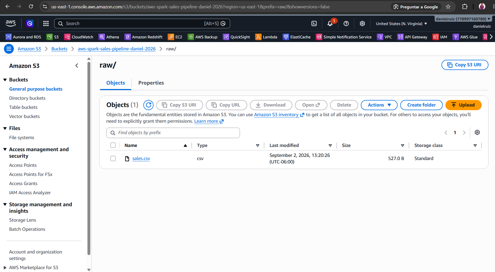
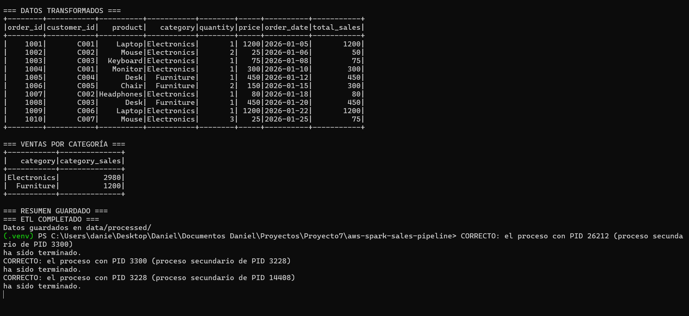
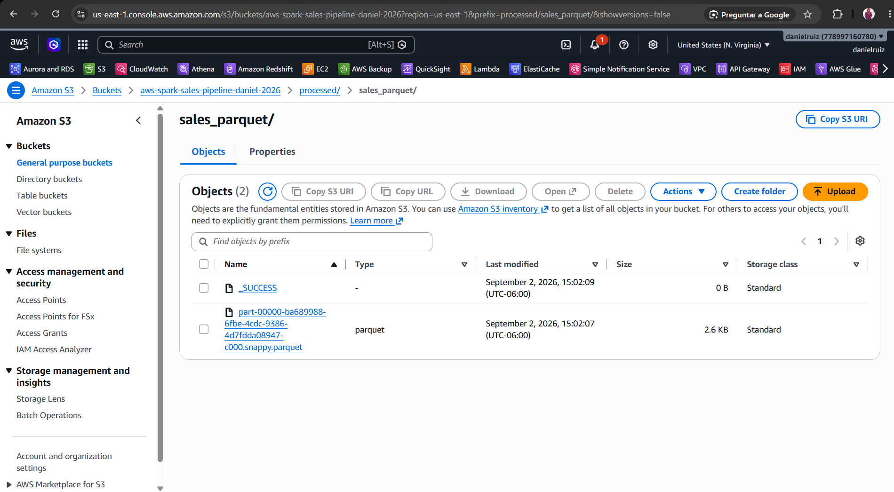
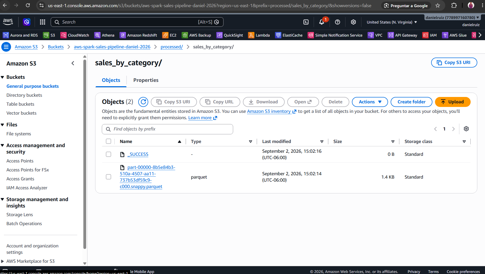

# AWS Spark Sales Pipeline

**Daniel Ruiz López**  
**Junior AWS Data Engineer**

[](https://www.python.org/)
[](https://spark.apache.org/docs/latest/api/python/)
[](https://spark.apache.org/)
[](https://aws.amazon.com/s3/)
[](https://parquet.apache.org/)
[](https://git-scm.com/)
[](https://github.com/danielruiz501)
[](https://www.linkedin.com/in/danielruizl/)
[](https://opensource.org/licenses/MIT)

📧 **Email:** danielruizlopez889@gmail.com

Apache Spark ETL pipeline for processing sales data stored in Amazon S3.

The project reads raw sales data from Amazon S3, performs transformations and aggregations using Apache Spark, and writes the processed results in Apache Parquet format back to Amazon S3.

## Architecture

```text
Amazon S3
   │
   │ raw/sales.csv
   ▼
Apache Spark
   │
   ├── Calculate total_amount
   │
   └── Aggregate sales by category
   │
   ▼
Amazon S3
   │
   ├── processed/sales_parquet/
   │
   └── processed/sales_by_category/

   ```

## AWS Services

- Amazon S3

## Technologies

- Python
- Apache Spark
- PySpark
- Hadoop AWS / S3A
- Amazon S3
- Parquet
- Git / GitHub

## Pipeline Process

### 1. Read raw data

The pipeline reads the sales CSV file from Amazon S3:

```text
s3a://aws-spark-sales-pipeline-daniel-2026/raw/sales.csv
```

### 2. Transform data

A new `total_amount` column is calculated:

```text
total_amount = quantity × price
```

### 3. Aggregate sales

The pipeline groups sales by category and calculates:

- Total orders
- Total units
- Total sales

### 4. Write processed data

The transformed sales dataset is stored as Parquet:

```text
processed/sales_parquet/
```

The category-level analysis is stored separately:

```text
processed/sales_by_category/

```

## Data Analysis Results

The Spark aggregation produced the following results:

| Category | Total Orders | Total Units | Total Sales |
|----------|--------------|-------------|-------------|
| Electronics | 7 | 10 | 2980 |
| Furniture | 3 | 4 | 1200 |

The processed datasets were successfully written to Amazon S3 in Apache Parquet format.

## 📸 Screenshots

### S3 Input Data

Raw sales data stored in Amazon S3 before processing.



### PySpark Processing

PySpark processes the sales data, calculates total sales, and performs the sales aggregation by category.



### S3 Processed Data

The transformed sales dataset is stored in Amazon S3 in Apache Parquet format with Snappy compression.



### Sales by Category

Aggregated sales results by category are stored separately in Amazon S3 in Apache Parquet format.



## Project Structure

```text
aws-spark-sales-pipeline/
│
├── data/
│   └── sales.csv
│
├── src/
│   └── spark_etl.py
│
├── sales_pipeline.py
├── README.md
├── .gitignore
├── .gitattributes
└── LICENSE
```

## How to Run

### 1. Activate the virtual environment

Windows PowerShell:

```powershell
.\.venv\Scripts\Activate.ps1
```

### 2. Run the Spark pipeline

```powershell
python sales_pipeline.py
```

The pipeline reads the raw sales data from Amazon S3, processes it with Apache Spark, and writes the results back to Amazon S3 in Apache Parquet format.


